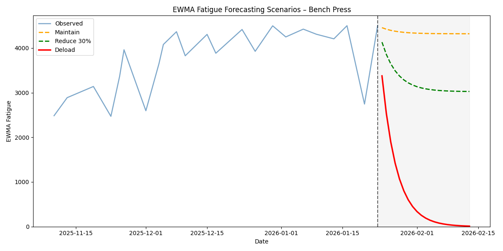

# Fitness & Recovery Analytics

A Python-based training load and fatigue modeling system built using real workout data from the Strong app.

This project models **training stress, latent fatigue, recovery dynamics, and performance relationships** in a mathematically grounded, fully interpretable way.

The goal is not black-box prediction — it is to build a clean state model of fatigue that aligns with real training structure.

---

## Core Concept

Fatigue is modeled as a **daily evolving state variable**, not just a record of workout events.

The system connects:

> Stress → Fatigue → Training Phase → Performance

Key components:

- Daily training stress  
- Exponentially Weighted Moving Average (EWMA) fatigue  
- Fatigue phase classification  
- Phase duration and transitions  
- Deterministic fatigue forecasting  

---

## Data Pipeline Overview

### 1. Ingestion

Raw Strong CSV exports are cleaned and normalized into:

`training_sets_normalized.csv`

Each row represents a single set with weight, reps, and timestamp.

---

### 2. Lift-Day Aggregation

Set-level data is aggregated into one row per exercise per day:

- Total training volume  
- Maximum weight lifted  
- Total sets and reps  
- Mean RPE (when available)  
- Training stress  

Stress is defined as:

- Volume-based when RPE is unavailable  
- RPE-weighted when available  

This provides the fundamental unit for fatigue modeling.

---

### 3. EWMA Fatigue Modeling

Fatigue is modeled using an Exponentially Weighted Moving Average:

$$
\text{EWMA}_t = \alpha x_t + (1-\alpha)\text{EWMA}_{t-1}
$$

Where:

- $x_t$ = daily stress  
- $\alpha$ controls decay rate  

This creates a smooth, memory-aware fatigue signal that:

- Rises during accumulation  
- Decays during rest  
- Captures structural training changes  

---

### 4. Fatigue Phase Classification

Using the smoothed derivative of EWMA:

- **Accumulating** → fatigue increasing  
- **Stable** → plateau  
- **Recovering** → fatigue decreasing  

Consecutive days are grouped into phase blocks to analyze training structure.

---

## Historical Fatigue Phases

Below is the EWMA fatigue signal for bench press with phase classification.

The phase segmentation aligns with ramp periods, recovery blocks, and structural programming shifts.

---

## Deterministic Fatigue Forecasting

Using the current fatigue state, the system projects forward under controlled stress scenarios:

- Maintain current load  
- Reduce load by 30%  
- Full deload  

This enables:

- Estimating days to recovery  
- Comparing reduction strategies  
- Planning deload timing  
- Scenario-based fatigue management  

The forecast is deterministic and interpretable — no neural networks or black-box models.

---

## Performance Modeling

A ridge regression evaluates how fatigue state relates to performance.

**Target:**  
- Maximum weight lifted per lift-day  

**Features:**  
- EWMA fatigue  
- Fatigue phase  
- Days since last session  

Results show consistent performance differences across fatigue phases, validating the fatigue signal as a structured latent variable.

---

## Outputs

Processed datasets are written to `data/processed/`:

- `training_sets_normalized.csv`
- `training_lift_day_aggregates.csv`
- `training_global_daily_fatigue.csv`
- `fatigue_phase_summary.csv`

---

## Design Philosophy

- Interpretability > complexity  
- Deterministic modeling before predictive modeling  
- Daily state evolution over sparse event modeling  
- Real training history as ground truth  

---

## Roadmap

- Lagged fatigue–performance modeling  
- Scenario optimization (minimum reduction to recover in N days)  
- Cross-lift fatigue interaction  
- Interactive visualization layer  